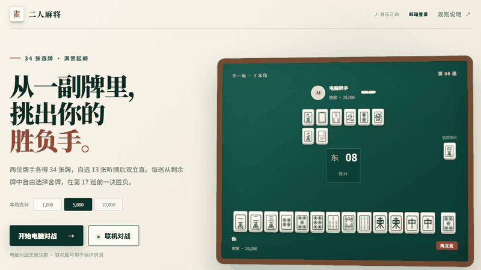
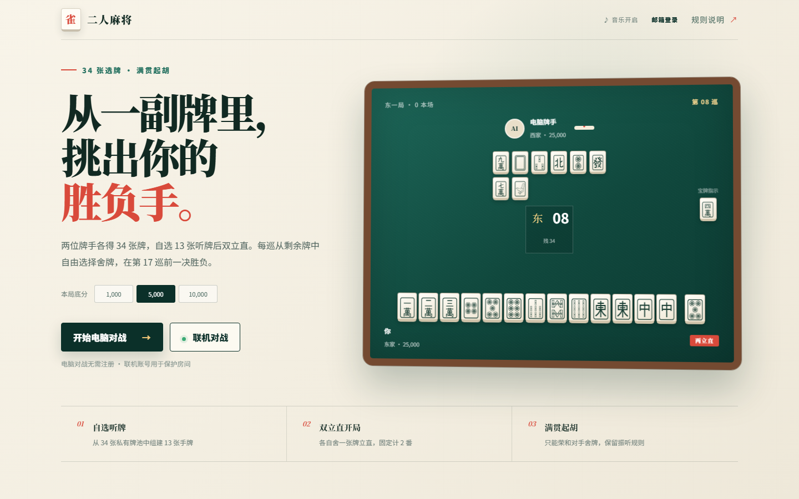
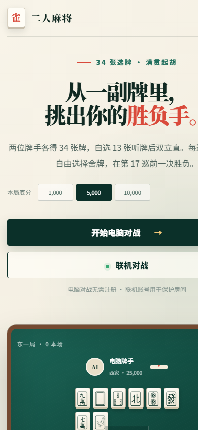
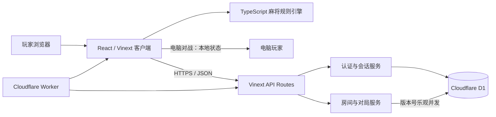

<div align="center">

# 17mah-jong · 二人麻将

**34 张自选听牌、两立直开局、满贯起胡的策略型二人麻将网页游戏。**

[](https://github.com/glow404/17mah-jong/actions/workflows/ci.yml)
[](#测试与质量门禁)
[](https://github.com/glow404/17mah-jong/releases)
[](LICENSE)

[在线试玩](https://mah-jong-duel-17.vuhanhst943546.chatgpt.site) · [规则说明](#完整游戏规则) · [本地开发](#本地开发) · [Roadmap](OPEN_SOURCE_ROADMAP.md) · [参与贡献](CONTRIBUTING.md)

**当前状态：v0.1.0 Preview，可完整进行电脑对战和房间码联机对战，仍在积极开发中。**

</div>



17mah-jong 保留日麻的听牌、役种、番符、宝牌和振听判断，但把摸切流程改造成“先构筑、后博弈”：每位玩家先从自己的 34 张牌池中组出 13 张听牌，再从剩余 21 张中自由选择每一巡要舍出的牌。胜负不只取决于牌型，也取决于你如何安排有限的出牌顺序、隐藏信息和放铳风险。

> 这是带有自定义规则的独立二人麻将，并非标准日本麻将或《雀魂麻将》的完整复刻。规则差异见[对照表](#与标准日麻的主要差异)。

## English summary

**17mah-jong** is an open-source, full-stack two-player riichi-inspired mahjong duel. Each player receives a private 34-tile pool, builds a 13-tile tenpai hand, and then chooses every discard from the remaining 21 tiles. The game supports guest-vs-CPU play, email-based accounts for six-character online rooms, dora and ura-dora, furiten, mangan-or-higher wins, responsive tile graphics, and synthesized music and sound effects. It is a playable v0.1.0 preview rather than a complete implementation of standard Japanese mahjong.

## 项目截图

| 桌面端                                                    | 移动端                                                     |
| --------------------------------------------------------- | ---------------------------------------------------------- |
|  |  |

## 功能一览

- 从真实 136 张牌墙中为两位玩家各发 34 张实体牌，选择 13 张听牌并自动分析等待牌。
- 剩余 21 张牌全部保留，每巡可以自由选择任意一张合法舍牌。
- 支持两立直、宝牌、里宝牌、番符、满贯以上等级和多种普通役/役满。
- 支持永久振听与放弃荣和后的临时振听；只能荣和对方舍牌。
- 电脑对战无需登录；联机模式支持邮箱密码注册、登录及六位房间码。
- 联机状态保存在 Cloudflare D1，并用版本号进行乐观并发控制。
- 和牌结算公开赢家手牌、和牌张、役种、表/里宝牌指示牌和底分倍率。
- 使用麻将图案牌面而非纯文本牌名，适配桌面与移动端。
- 背景音乐、舍牌和荣和音效由 Web Audio API 实时合成，可随时关闭。

## 完整游戏规则

### 1. 牌墙与选牌

1. 使用标准的 136 张麻将牌：万、筒、索各 1～9，每种 4 张；东、南、西、北、白、发、中各 4 张。
2. 洗牌后，庄家与闲家各获得互不重叠的 34 张实体牌；另翻出 1 张表宝牌指示牌，并预留 1 张里宝牌指示牌。
3. 每位玩家从自己的 34 张中选择恰好 13 张作为固定手牌。手牌必须已经听牌，系统会显示等待牌和按当前规则计算的预估番符。
4. 未选入手牌的 21 张成为该玩家的私人“舍牌池”，不会再摸入手牌，也不会被对手看到。

### 2. 开局与回合

1. 庄家固定为东风，闲家固定为西风；庄家先行动。
2. 双方第一次舍牌即视为立直，本项目固定按“两立直”计算 2 番，不支付立直棒。
3. 此后双方交替行动。轮到自己时，可以从仍未打出的私人舍牌池中任意选择 1 张舍出，而不是从牌墙摸 1 张再打 1 张。
4. 不允许吃、碰、杠、拔北或改变已经确认的 13 张手牌。

### 3. 荣和、振听与流局

1. 只能荣和对手刚刚舍出的牌，不能自摸。
2. 合计必须达到满贯或更高等级才能出现荣和按钮；已成和但不足满贯的牌不能和牌。
3. 如果自己的牌河中出现了当前任一等待牌，则处于永久振听，不能荣和。
4. 若玩家放弃一次可以成立的荣和，则进入临时振听；直到自己完成下一次舍牌后解除。
5. 当双方都打出第 17 张牌后仍无人荣和，本局流局；每人的最后 4 张私人牌不会打出。

### 4. 役种、宝牌与计分

- 固定役：两立直 2 番。
- 已实现普通役：平和、断幺九、一杯口、役牌、自风、三色同顺、三色同刻、一气通贯、对对和、三暗刻、混老头、混全带幺九、纯全带幺九、混一色、清一色、七对子和小三元。
- 已实现役满：国士无双、大三元、四暗刻、字一色、绿一色、清老头、小四喜、大四喜和九莲宝灯。
- 表宝牌始终参与计算；里宝牌指示牌只有在和牌结算时公开，并计入最终番数。
- 等级边界采用日麻常用阈值：5 番、4 番 40 符或 3 番 70 符为满贯；6～7 番跳满；8～10 番倍满；11～12 番三倍满；13 番及役满牌型按役满。
- 每局先选择底分 1,000、5,000 或 10,000。最终结算为：满贯 ×1、跳满 ×1.5、倍满 ×2、三倍满 ×3、役满 ×4；当前版本不使用标准日麻的庄闲支付、点棒和本场计算。

### 与标准日麻的主要差异

| 项目       | 17mah-jong                             | 标准四人日麻                              |
| ---------- | -------------------------------------- | ----------------------------------------- |
| 玩家与配牌 | 2 人；各得 34 张并自选 13 张听牌       | 4 人；随机配 13 张手牌                    |
| 回合结构   | 不摸牌，从个人剩余 21 张中任选一张舍出 | 从牌山摸牌后舍一张                        |
| 开局立直   | 首张舍牌自动按两立直 2 番计算          | 满足门清听牌、点棒等条件后自行宣告        |
| 和牌方式   | 只允许荣和对手舍牌                     | 通常允许荣和与自摸                        |
| 副露       | 不允许吃、碰、杠                       | 允许符合条件的吃、碰、杠                  |
| 起胡门槛   | 必须达到满贯                           | 有至少 1 个役即可和牌                     |
| 振听       | 保留舍牌振听和放弃荣和后的临时振听     | 另包含与巡目、立直相关的完整细则          |
| 流局条件   | 双方各舍 17 张仍无人和牌               | 牌山耗尽或触发特殊流局                    |
| 风位与局数 | 固定东家/西家、单局对决                | 局风、座风、连庄和半庄/东风战轮转         |
| 结算       | 底分乘限界倍率                         | 按基本点、庄闲、荣和/自摸、本场与供托支付 |

## 已知限制

- 规则引擎只覆盖上方列出的役种和自定义番符规则，并非《雀魂麻将》或日本竞技麻将规则的完整兼容实现。
- 电脑玩家目前使用基础选牌推荐与随机合法舍牌，没有难度分级、攻防判断或可复现随机种子。
- 联机同步采用约 1.2 秒一次的 HTTP 轮询，尚未使用 WebSocket / Durable Objects，也没有完善的断线恢复和回放。
- 当前只有房间码约战，没有公开匹配、观战、好友、排行榜或持久化战绩。
- 账号系统尚未提供邮箱验证、找回密码和账号删除流程；公开演示环境不承诺生产级 SLA。
- 自动化测试覆盖规则引擎、认证/房间 API、临时 D1 数据库和 Playwright 双浏览器流程；规则行覆盖率为 96.84%。
- Vinext 仍为 beta 依赖，升级 React、Vite 或 Cloudflare 运行时时需要进行完整回归验证。

## 技术栈

| 层级       | 技术                                                     |
| ---------- | -------------------------------------------------------- |
| 前端       | React 19、TypeScript、Vinext App Router、CSS             |
| 规则引擎   | 纯 TypeScript；牌型拆解、听牌、役种、番符、宝牌与振听    |
| 服务端     | Vinext Route Handlers、Cloudflare Workers                |
| 数据层     | Cloudflare D1 / SQLite、Drizzle ORM、SQL migrations      |
| 身份认证   | 邮箱密码、PBKDF2 加盐派生、哈希会话令牌、HttpOnly Cookie |
| 工程质量   | ESLint、TypeScript、Node test runner、GitHub Actions     |
| 音频与牌面 | Web Audio API 实时合成、Unicode 麻将字符与系统字体       |

## 系统架构



电脑对战完全在浏览器内运行，不需要账号或数据库。联机对战的数据流如下：

1. 客户端注册或登录，服务端验证密码派生值并写入 HttpOnly 会话 Cookie。
2. 房主创建房间，服务端生成六位房间码和双方独立的房间凭证；另一位已登录用户用房间码加入。
3. 双方提交 13 张实体牌 ID。服务端验证牌属于个人牌池、数量不重复且手牌已经听牌。
4. 客户端每约 1.2 秒读取一次经过座位裁剪的公开牌局快照；对手手牌、私人舍牌池和里宝牌保持隐藏。
5. 舍牌、放弃荣和与荣和请求由服务端验证回合和权限，再以 `version` 作为条件更新 D1，冲突请求返回 409 而不会覆盖较新的状态。
6. 荣和后服务端返回赢家手牌和里宝牌指示牌，客户端展示完整结算。

## 本地开发

### 环境要求

- Node.js 22.13.0 或更高版本
- npm 10 或更高版本
- Git

```bash
git clone https://github.com/glow404/17mah-jong.git
cd 17mah-jong
npm ci
npm run db:migrate:local
npm run dev
```

打开 `http://localhost:3000`。本地开发默认使用 Wrangler 的本地 D1 数据库，不需要 Cloudflare 登录；电脑对战本身也不依赖数据库。

### D1 初始化与数据库迁移

现有迁移位于 `drizzle/`。首次本地启动或迁移更新后运行：

```bash
npm run db:migrate:local
```

修改 `db/schema.ts` 后生成新的迁移并再次应用：

```bash
npm run db:generate
npm run db:migrate:local
```

为自己的 Fork 部署时，先创建独立 D1 数据库，把命令返回的 `database_id` 写入 `wrangler.jsonc`，再明确应用远程迁移：

```bash
npx wrangler login
npx wrangler d1 create mahjong-db
npm run db:migrate:remote
```

不要把密码、API Token、Cookie、`.dev.vars`、`.env*` 或本地数据库提交到 Git。执行远程迁移前务必确认 Wrangler 当前登录的账号和目标数据库。

### 构建与部署

```bash
npm run build
npx wrangler deploy
```

部署后把 GitHub 仓库的 Website、`package.json#homepage` 和 README 试玩地址更新为自己的公开 URL。生产环境必须先完成远程 D1 迁移；部署回滚和数据备份方案仍是后续 Roadmap 项目。

## 测试与质量门禁

```bash
npm run lint           # ESLint
npm run format:check   # Prettier 格式检查
npm run typecheck      # TypeScript 静态类型检查
npm run test:unit      # 规则引擎单元测试
npm run test:integration # D1 迁移与服务集成测试
npm run test:e2e        # E2E smoke test（设置 E2E_BASE_URL 后执行）
npm run test:coverage  # 单元测试 + Node 内置覆盖率报告
npm run build          # 生产构建
npm run ci             # 依次执行以上全部质量检查
```

规则引擎当前行覆盖率为 **96.84%**、分支覆盖率为 **95.19%**、函数覆盖率为 **100%**。CI 会在每次推送到 `main` 和针对 `main` 的 Pull Request 上执行同一套质量门禁；规则引擎门槛为 90%，全项目目标为 80%。覆盖率目标集中记录在 [`coverage-targets.json`](coverage-targets.json)。

## 主要目录

```text
app/                     页面、客户端状态与 API Route Handlers
db/                      D1 访问、认证、房间存储与 Drizzle schema
drizzle/                 可重复执行的数据库迁移
lib/mahjong.ts           牌表示、听牌、牌型、番符、计分与振听
tests/mahjong.test.ts    规则引擎回归测试
docs/assets/             README 截图与玩法演示
.github/                 CI、Issue Forms 与 Pull Request 模板
worker/                  Cloudflare Worker 入口
```

## Roadmap 与社区

- [开源成熟化 Roadmap](OPEN_SOURCE_ROADMAP.md)：CI、安全、规则测试、实时联机、AI、回放和 v1.0 验收计划。
- [规则兼容矩阵](docs/RULE_COMPATIBILITY.md)：逐项说明与标准日本麻将/雀魂的相同与不同。
- [贡献指南](CONTRIBUTING.md)：开发环境、分支、Conventional Commits 和 Pull Request 流程。
- [Good first issues](https://github.com/glow404/17mah-jong/labels/good%20first%20issue) 与 [Help wanted](https://github.com/glow404/17mah-jong/labels/help%20wanted)：适合首次参与的任务。
- [安全策略](SECURITY.md)：请按私密渠道报告未修复漏洞，不要创建公开 Issue。
- [更新日志](CHANGELOG.md)：按 Keep a Changelog 维护版本变化。
- [资源许可审计](docs/ASSET_LICENSES.md)：图片、字体、牌面和音频来源说明。
- [MIT License](LICENSE)：代码与项目自制素材的开源许可。

欢迎提交规则测试、用户体验、无障碍、文档和工程质量改进。开始前请阅读[贡献指南](CONTRIBUTING.md)与[社区行为准则](CODE_OF_CONDUCT.md)。
